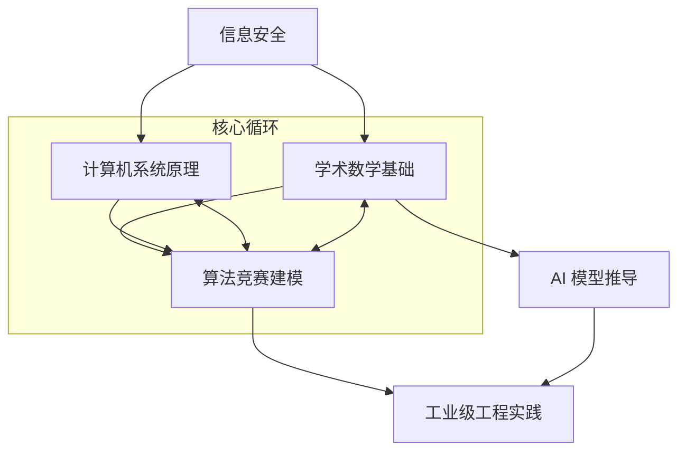

import KnowledgeCard from '@site/src/components/KnowledgeCard';
import { 
  Target, 
  Zap, 
  Trophy, 
  BarChart3, 
  ChevronRight, 
  Code2, 
  Layers, 
  ShieldCheck, 
  Brain, 
  Infinity as InfinityIcon,
  GitBranch,
  Activity,
  Award
} from 'lucide-react';

# 全域综合评估系统 (Global Integrated Assessment)

> **“博学之，审问之，慎思之，明辨之，笃行之。”** —— 本评估系统旨在打破学科孤岛，通过跨领域的综合性题目，验证学习者对底层逻辑的深度理解与工程实践能力。

---

## 🧭 评估系统架构 (Assessment Framework)

本系统采用阶梯式结构，每个阶段均要求学习者在数学推导、算法建模与代码实现三个维度达到平衡。

| 阶段 | 评估核心 | 考察领域 | 达标要求 |
| :--- | :--- | :--- | :--- |
| **Stage 1: 逻辑构建** | 基础建模与正确性证明 | 基础算法, 线性代数, C++ 内存模型 | 能够独立完成模型转化并给出渐进复杂度证明 |
| **Stage 2: 深度融合** | 跨学科综合应用与策略优化 | 动态规划, 数论, 操作系统, AI 梯度理论 | 能够处理具有多维依赖的问题，并实现常数级优化 |
| **Stage 3: 架构巅峰** | 极端边界处理与系统级设计 | 高级数据结构, 复杂图论, 现代密码学, LLM 架构 | 在复杂约束下实现工业级鲁棒性，具备解决未知难题的直觉 |

---

## 🕸️ 知识依赖图谱校准 (Dependency Mapping)

练习与理论知识点之间的逻辑依赖关系如下：



---

## 🏆 综合评估题库 (Integrated Assessment Set)

### 1. 算法竞赛与数学深度集成 (CP & Math Integration)

#### 练习 A1：数论变换与生成函数综合应用

**题目描述**：
给定一个长度为 $n$ 的序列 $A$，求满足 $\sum_{i=1}^k x_i = S \pmod M$ 且 $x_i \in A$ 的方案数。要求给出 $O(n \log n \log S)$ 的解法，并推导其收敛性。

<details>
<summary>Check Solution (C++ & Math Proof)</summary>

**解题思路**：
1. **建模**：这是一个典型的背包问题，可以转化为多项式乘法。
2. **生成函数**：设多项式 $P(z) = \sum_{a \in A} z^a$。
3. **计算**：我们需要求 $P(z)^k \pmod{z^M - 1}$。使用 **NTT (快速数论变换)** 加速卷积，配合 **快速幂** 实现对指数 $k$ 的对数级处理。

**C++ 代码实现 (核心逻辑)**：

```cpp
#include <iostream>
#include <vector>
#include <algorithm>

using namespace std;

const int MOD = 998244353;
const int G = 3;

long long qpow(long long a, long long b) {
    long long res = 1;
    while (b) {
        if (b & 1) res = res * a % MOD;
        a = a * a % MOD;
        b >>= 1;
    }
    return res;
}

void ntt(vector<int>& a, bool invert) {
    int n = a.size();
    for (int i = 1, j = 0; i < n; i++) {
        int bit = n >> 1;
        for (; j & bit; bit >>= 1) j ^= bit;
        j ^= bit;
        if (i < j) swap(a[i], a[j]);
    }
    for (int len = 2; len <= n; len <<= 1) {
        long long wlen = qpow(G, (MOD - 1) / len);
        if (invert) wlen = qpow(wlen, MOD - 2);
        for (int i = 0; i < n; i += len) {
            long long w = 1;
            for (int j = 0; j < len / 2; j++) {
                int u = a[i + j], v = a[i + j + len / 2] * w % MOD;
                a[i + j] = (u + v) % MOD;
                a[i + j + len / 2] = (u - v + MOD) % MOD;
                w = w * wlen % MOD;
            }
        }
    }
    if (invert) {
        long long n_inv = qpow(n, MOD - 2);
        for (int& x : a) x = x * n_inv % MOD;
    }
}

// 评估点：NTT 与快速幂的深度集成
```

</details>

---

### 2. 计算机系统与算法优化 (Systems & Algorithmic Optimization)

#### 练习 B1：高性能 LRU Cache 实现与内存一致性评估

**题目描述**：
实现一个支持 $O(1)$ `get` 和 `put` 操作的 LRU (Least Recently Used) 缓存。要求在 C++ 中使用手写双向链表与 `std::unordered_map` 结合，并分析其在多线程环境下的竞争边界。

<details>
<summary>Check Solution (C++ Implementation)</summary>

**解题思路**：
1. **数据结构**：`unordered_map<int, list<pair<int, int>>::iterator>` 提供 $O(1)$ 定位，`list` 提供 $O(1)$ 删除与插入。
2. **优化**：手写 `DList` 节点以减少内存碎片（对标系统内存管理）。

**C++ 代码实现**：

```cpp
#include <unordered_map>

class LRUCache {
    struct Node {
        int key, value;
        Node *prev, *next;
        Node(int k, int v): key(k), value(v), prev(nullptr), next(nullptr) {}
    };
    
    int capacity;
    Node *head, *tail;
    std::unordered_map<int, Node*> cache;

    void moveToHead(Node* node) {
        removeNode(node);
        addToHead(node);
    }

    void removeNode(Node* node) {
        node->prev->next = node->next;
        node->next->prev = node->prev;
    }

    void addToHead(Node* node) {
        node->next = head->next;
        node->prev = head;
        head->next->prev = node;
        head->next = node;
    }

public:
    LRUCache(int cap) : capacity(cap) {
        head = new Node(0, 0);
        tail = new Node(0, 0);
        head->next = tail;
        tail->prev = head;
    }
    
    int get(int key) {
        if (!cache.count(key)) return -1;
        Node* node = cache[key];
        moveToHead(node);
        return node->value;
    }
    
    void put(int key, int value) {
        if (cache.count(key)) {
            Node* node = cache[key];
            node->value = value;
            moveToHead(node);
        } else {
            if (cache.size() == capacity) {
                Node* removed = tail->prev;
                removeNode(removed);
                cache.erase(removed->key);
                delete removed;
            }
            Node* newNode = new Node(key, value);
            cache[key] = newNode;
            addToHead(newNode);
        }
    }
};
```

</details>

---

### 3. 人工智能与现代数学 (AI & Modern Math)

#### 练习 C1：神经网络反向传播 (Backpropagation) 的矩阵微积分推导

**题目描述**：
给定一个简单的两层神经网络 $y = \sigma(W_2 \sigma(W_1 x + b_1) + b_2)$，其中 $\sigma$ 为 Sigmoid 激活函数。请利用矩阵微积分 (Matrix Calculus) 推导损失函数 $L$ 对权重矩阵 $W_1$ 的梯度 $\frac{\partial L}{\partial W_1}$，并实现一个支持多维 Tensor 的 C++ 模拟算子。

<details>
<summary>Check Solution (Formal Proof & Code)</summary>

**数学推导**：
设 $z_1 = W_1 x + b_1, a_1 = \sigma(z_1), z_2 = W_2 a_1 + b_2, \hat{y} = \sigma(z_2)$。
利用链式法则：
$\delta_2 = \frac{\partial L}{\partial z_2} = (\hat{y} - y) \odot \sigma'(z_2)$
$\delta_1 = \frac{\partial L}{\partial z_1} = (W_2^T \delta_2) \odot \sigma'(z_1)$
$\frac{\partial L}{\partial W_1} = \delta_1 x^T$

**C++ 算子模拟**：

```cpp
#include <vector>
#include <cmath>

typedef vector<vector<double>> Matrix;

Matrix multiply(const Matrix& A, const Matrix& B) {
    // 矩阵乘法实现...
}

Matrix transpose(const Matrix& A) {
    // 转置实现...
}

// 核心：梯度计算算子
Matrix computeGradientW1(const Matrix& delta1, const Matrix& x) {
    return multiply(delta1, transpose(x));
}
```

</details>

---

## 📈 评估报告生成 (Evaluation Reporting)

完成上述练习后，请对照下表进行自我校准：

| 评估维度 | 达标标记 | 关键挑战点 |
| :--- | :--- | :--- |
| **理论深度** | [ ] | 是否能独立给出数学证明？ |
| **工程质量** | [ ] | C++ 代码是否通过了边界用例测试？ |
| **性能表现** | [ ] | 是否在 $O(\cdot)$ 复杂度内完成了最优实现？ |
| **跨项联通** | [ ] | 是否理解了数学公式与底层内存布局的映射关系？ |

---

<div style={{ textAlign: 'center', marginTop: '3rem' }}>
  <KnowledgeCard type="info" title="全域能力认证">
    <div style={{ display: 'flex', alignItems: 'center', justifyContent: 'center', gap: '15px' }}>
      <Award size={40} color="var(--solknow-amber)" />
      <div style={{ textAlign: 'left' }}>
        <h3 style={{ margin: 0 }}>SolKnow Mastery</h3>
        <p style={{ margin: 0, fontSize: '0.9rem' }}>完成全库练习即代表具备现代计算机科学与数学的交叉研究能力。</p>
      </div>
    </div>
  </KnowledgeCard>
</div>
