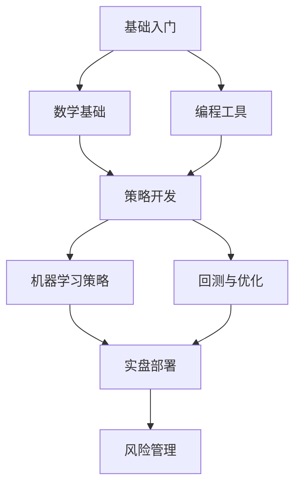

# 量化交易知识库

欢迎来到 **SolKnow 量化交易知识库** —— 一个系统化的量化投资与算法交易学习平台。

## 知识库定位

本知识库面向以下读者：
- **初学者**：零基础入门量化交易，了解基本概念与工具
- **开发者**：将编程技能应用于金融市场，构建交易系统
- **数学/金融背景**：掌握数学建模与统计方法在交易中的应用
- **算法竞赛选手**：将算法优化思维应用于高频与策略交易

## 学习路径

## 核心模块

### 📚 基础入门 (`basics/`)
- 量化交易概述与发展历程
- 金融市场基础（股票、期货、期权、外汇）
- 交易机制与订单类型
- 市场微观结构
- 量化交易生态与数据源

### 🔢 量化数学 (`math/`)
- 时间序列分析
- 随机过程与布朗运动
- 统计套利与协整
- 优化理论与投资组合
- 蒙特卡洛模拟

### 💡 策略开发 (`strategy/`)
- 经典策略：动量、均值回归、趋势跟踪
- 统计套利策略
- 事件驱动策略
- 高频交易策略
- 因子投资与多因子模型

### 💻 编程与工具 (`programming/`)
- Python 量化生态（NumPy, Pandas, Numba）
- C++ 高性能计算
- 数据获取与处理
- 数据库与存储
- API 对接与自动化

### 🤖 机器学习 (`ml/`)
- 特征工程与因子挖掘
- 监督学习：分类与回归
- 无监督学习：聚类与降维
- 强化学习在交易中的应用
- 深度学习：LSTM、Transformer

### 📊 回测系统 (`backtest/`)
- 回测框架原理
- 过拟合与样本外测试
- 滑点与手续费建模
- 事件驱动回测
- 向量化 vs 事件驱动

### ⚠️ 风险管理 (`risk/`)
- 风险度量：VaR、CVaR、最大回撤
- 仓位管理与凯利公式
- 对冲与市场中性
- 极端风险与尾部事件
- 合规与监管

### 🛠️ 实用工具 (`tools/`)
- 开源框架：Backtrader、Zipline、QuantConnect
- 商业平台：聚宽、米筐、优矿
- 数据源：Tushare、AKShare、Yahoo Finance
- 可视化与监控

### 🎯 实战案例 (`practice/`)
- 完整策略案例解析
- 实盘部署经验
- 常见陷阱与解决方案
- 量化面试准备

## 推荐学习顺序

1. **第一阶段（1-2周）**：阅读 `basics/` + `programming/` 基础
2. **第二阶段（2-4周）**：学习 `math/` + `strategy/` 经典策略
3. **第三阶段（3-4周）**：实践 `backtest/` + 复现 `practice/` 案例
4. **第四阶段（持续）**：深入 `ml/` + `risk/` 并实盘测试

## 相关资源

- [算法竞赛知识库](/docs/intro) — 算法优化思维
- [系统数学知识库](/docs/academic-math/) — 数学理论与证明
- [人工智能知识库](/docs/ai/) — 机器学习方法
- [计算机知识库](/docs/cs/) — 系统与网络基础

---

> ⚠️ **风险提示**：量化交易涉及金融风险，本知识库仅供学习研究，不构成投资建议。过往回测表现不代表未来收益。
